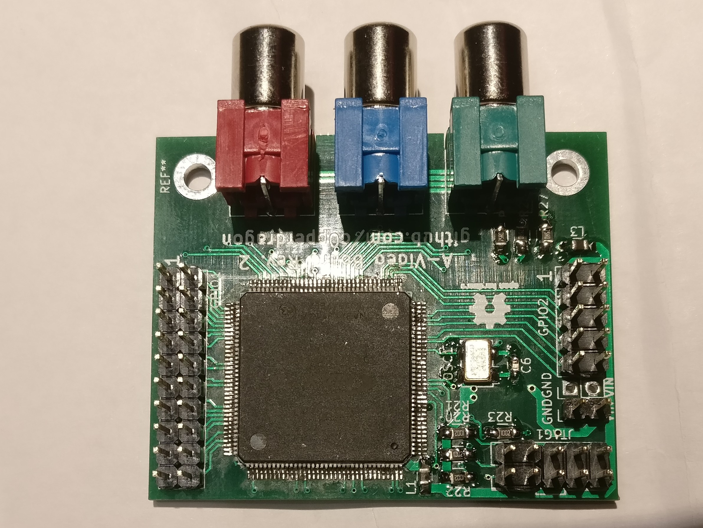
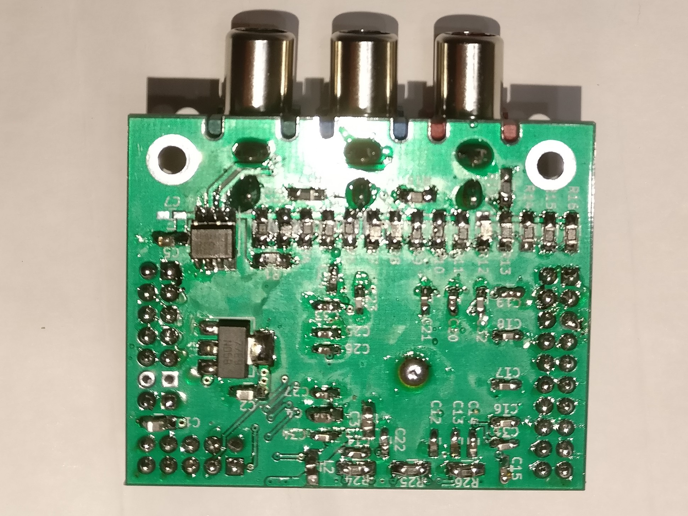

# A-Video Board

A small FPGA board with a component video interface to directly drive
an analog monitor or TV input.
Its main purpose is to create component video / RGB mods of vintage
home computers and consoles or to provide video output for hobby projects.

It consists of the purest minimum parts necessary to have a multi-purpose
FPGA combined with a simple way to generate a YPbPr signal. After much research
I finally settled on a cheap MAX 10 device in a TQFP-144 package which I can 
solder by hand (barely). The rest of the parts are pretty cheap and quite easy to solder. 

To interface any of the vintage systems to the A-Video Board, level shifters
are necessary to translate the 5 volt to 3.3 volt for the FPGA input pins. These level
shifters can be implemented in a system specific daughter board that can be stacked
on top of the A-Video board. Any such interface board can probably be implemented in a 
simple single-sided wide-pitch PCB that can be even home-etched with some experience.

Currently I have built applications of the A-Video board for 
* [Atari 8 bit machines](/atarimod)
* [ZX Spectrum](/zxspectrummod)

## Images

## Board design

The board has these main parts

* 10M02SCE144: fairly cheap FPGA of the MAX10 series)
* LM1117IMPX-3.3:   linear voltage regulator)
* LFSPX0024957:     25Mhz clock generator)
* THS7316:          video output amplifier)
* R1-R19:           three 5-bit ADCs made from transistors)

and various supporting passive components, mainly decoupling and pull-ups.

I has the following connectors:
* GPIO1  20-pin header that directly connects to FPGA pins
* GPIO2  10-pin header with two pins providing GND and +3.3V, the remaining 8 connect to the FPGA.
* JTAG   10-pin header for programming the FPGA (via an USB-Blaster or compatible device)
* 3 RCA sockets to output the video signal (normally YPbPr, but other formats could be produced as well)

## Contact
If you plan to use an A-Video board, feel free to contact me for assistance:
reinhard.grafl (at) aon.at  
Maybe I will either have some spare PCBs I could send you to populate yourself,
or even provide you will a fully assembled board for the cost of the parts and shipping. 
