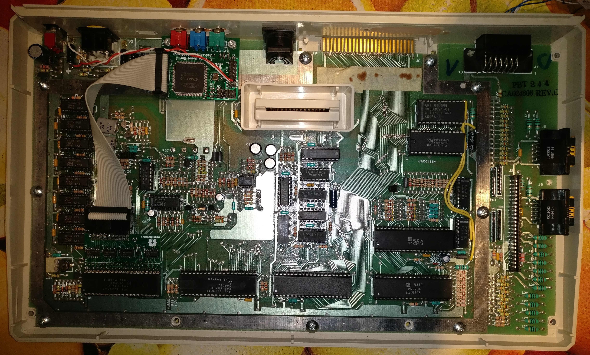

# Atari RGB Mod

Built on the A-Video board, this is a modification usable for Atari 8-bit 
computers that generate YPbPr signal in either 288p or 576p to display on
modern displays. 

## Motivation

These old Atari computers generate the colour output signal directly in the weird way that was
necessary to construct a PAL or NTSC signal. The technique is called "quadrature amplitude modulation" and has the
disadvantage of not being completely reversible, so the original colours can not be reconstructed from this
signal.
Even worse, the XL line of machines does not even provide this signal directly on the video output, but
only already combined with the luminance signal as composite video. There are simple ways to provide 
separate luminance and colour, but even then the quality is pretty bad. 
This was not such a problem on cathode ray tube (CRT) displays, but on modern LCD TVs this signal looks totally
unusable.

So, no matter how I tried, I could not reliably re-construct the original colours from the colour signal output. 
The only way to really solve the issue was to intercept the necessary information in digital form to 
create a perfectly sharp and clear analog video signal by my own circuitry. 

## Theory of Operation

The FPGA chip passively listens to all relevant pins of the GTIA graphics chip and re-implements the 
relevant logic of the GTIA in its logic fabric, effectively providing a second GTIA (parts of it).
To sniff the signals from the GTIA, a specific adapter board is needed that sits between the 
GTIA and its socket. Revision 3 of the adapter is now pretty small and should fit in all Atari models.
From this adapter, a 20-pin ribbon cable (either mounted permanently to the adapter or using a plug)
leads to the FPGA board.
This FPGA board can either be the generic A-Video board or a re-purposed C64 Video Enhancement Board. 
Both boards are firmeware-compatible, but differ in their size and connector options. You should 
also be able to fairly easily change these connectivity options anyway.

## Adapter building details (Rev. 3)

In the doc folder, there are schematics, gerber files and a bill of material to build the adapter.
Ideally you need a 0.8mm PCB (a slighly thicker boards will also work) and assemble everything except
the P1 socket.  This specific socket is meant to be put into the big holes, so the extra-long solder tails 
will stick out pretty far on the bottom side. These will then fit into the IC socket on the Atari.
Take care not to get any solder onto these thin tails when soldering the ticker barrels into the 
adapter board (this can become tricky, but with a 0.8mm board it should not be too hard).
Before actually soldering the socket you have to cut away one of the plastic cross-beams so it
will not conflict with the ICs.

For attaching the 20-pin ribbon cable to P2, you have several options. I used an angled 
pin-header with a standard ribbon cable connector to keep a low profile. If there is space 
in your device you can as well use a straight pain-header. An even more sophisticated option
is a permantent PCB-to-ribbon-cable header which can be found with quite a low profile.
You can even solder the ribbon cable wires direcly into the board or whatever you fancy.
 

## FPGA Details

The FPGA on the A-Video board is programmed in VHDL, using the free version of the Quartus II development suite.
This chip has an on-board non-volatile program memory, so no external flash is needed and the chip has
a very short start-up time. There is a PLL built in which I use to generate a 228Mhz clock from the 25Mhz reference.
With this 228Mhz and some advanced  programming I can multiply the Atari pixel clock to a pretty clean (below 1 ns jitter) 14,1875 MHz clock to drive the whole circuit and create a nice output signal.

On non-PAL machines the Atari pixel clock runs at a slightly different speed. There the clock multiplier circuit will actually produce an internal clock that has variations in their clock cycle length. This will lead
to a slightly different length of every other pixel in 240p mode, and of every 4th pixel in 480p mode.

## Output

The mod can be used to create three different output formats:
* 240p/288p  (default)
* 480p/576p
* 480p/576p with scanline effect 

Selecting the output can be done by jumper connectors or an external switch (already provided 
in the C64 Video Enhancement):
* Connect GPIO2_4 to GND: 480p/576p
* Connect GPIO2_5 or GPIO2_6 to GND: 480p/576p with scanline effect

## Images
")

