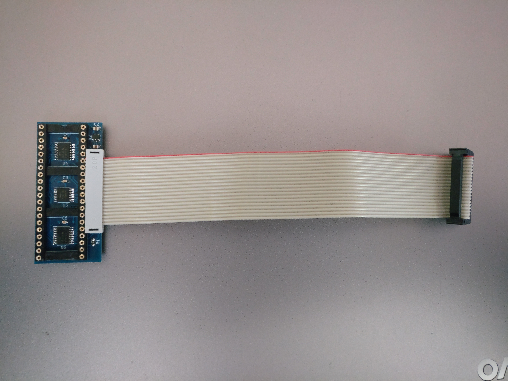
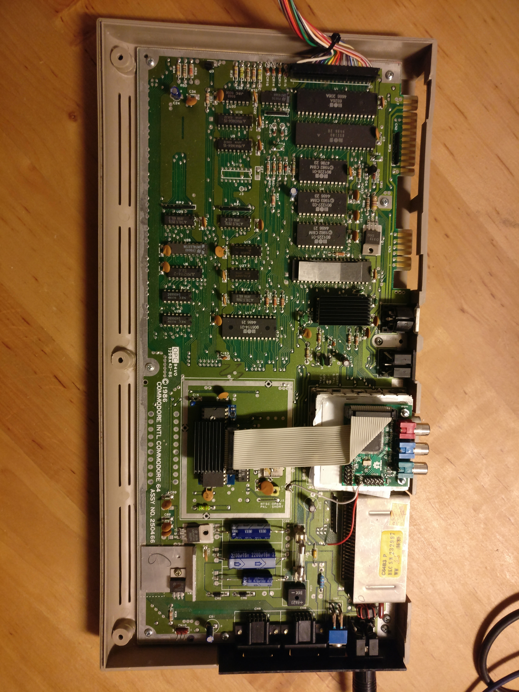
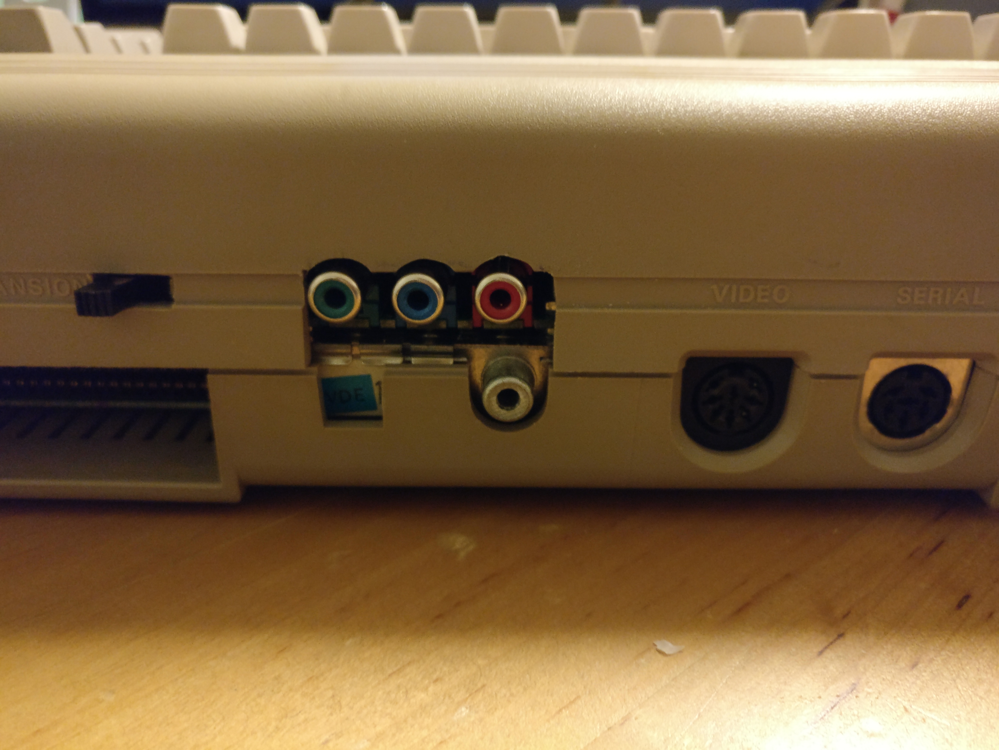

# C64 RGB Mod

Built on the A-Video board, this is a modification usable for the Commodore 64 computer
that generates a YPbPr signal in either 288p or 576p to display on modern displays.

## Motivation

I wanted to get the most perfect display from an original C64 computer. After many failed attempts to 
reconstruct a digitally perfect pixel-by-pixel display from the S-Video output, I finally came back
to my original idea to emulate the inner workings of the VIC-II chip. 
So, as for the atari 8-bit line and the ZX Spectrum, I applied my trusty A-Video board. 

## Building details

The FPGA chip passively listens to all relevant pins of the VIC graphics chip and re-implements the 
relevant logic of the GTIA in its logic fabric, effectively providing a second VIC (parts of it).
The mod board consists of two parts: A small adapter board that sits under the VIC and sniffs all relevant
pins, and the A-Video board that does the actual processing. The 5 volt signals from the C64 are
level-shifted by the adapter board down to 3.3 volts for use by the FPGA.
Since the adapter board only listens to the signals (with very high-impedience input pins), it 
will not influence the working of the VIC or any other part of the system in any way. The FPGA implementation
may have some glitches, but this should only affect the visual output.
Note that the mod consumes an additional 100mA of current from the 5 volt rail, 
so make sure that your power supply can handle this.

## Assembling the VIC adapter board

If you want to build your own adapter board, you need to have a PCB manufactured with 0.8mm thickness 
(use the gerber.zip for ordering). After soldering the ICs and passives, you need to fit a 40-pin
IC socket into the big holes. Use the socket type with round pins (the more expensive ones).
Solder from below and remove as much excess solder as possible. Then install the ribbon cable connector.
Take special care when installing the voltage regulator, as this small package always gave me the most trouble.
For your convenience, I have set up a [BOM](doc/adapterboard_bom.ods) and a parts list at 
[mouser](https://www.mouser.com/ProjectManager/ProjectDetail.aspx?AccessID=2b75b16750)
containing everything to build the board.

## Connectors

In my current build, the A-Video port is just screwed on top of the existing RF modulator.
This saved me the trouble of removing the modulator first (which would need additional circuitry to
keep the A/V output working). But this comes at the cost that the back of the computer case 
now has a rather large and ugly hole. I am pretty sure there are good solutions available to get rid of
this big modulator box while keeping the A/V functionality. Then the YPbPr connectors would be located
much lower and would look more natural.
If you even want a totally reversible mod you could probably place the A-Video board somewhere inside the
case and bring out the YPbPr cable through the user port opening.

## Output

The mod can be used to create three different output formats:
* 288p (default)
* 576p
* 576p with scanline effect

Selecting the output can be done by jumper connectors or an external switch:
* Connect GPIO2_4 to GPIO2_2 (GND): 576p
* Connect GPIO2_6 to GPIO2_2 (GND): 576p with scanline effect

## Images

")

