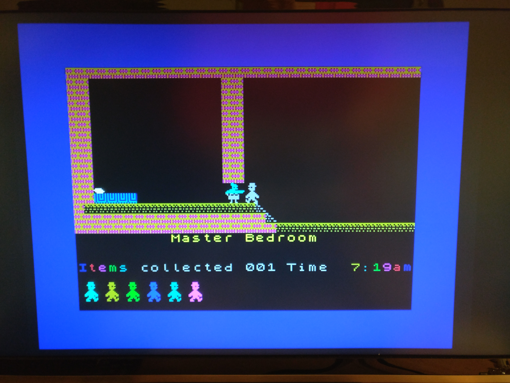
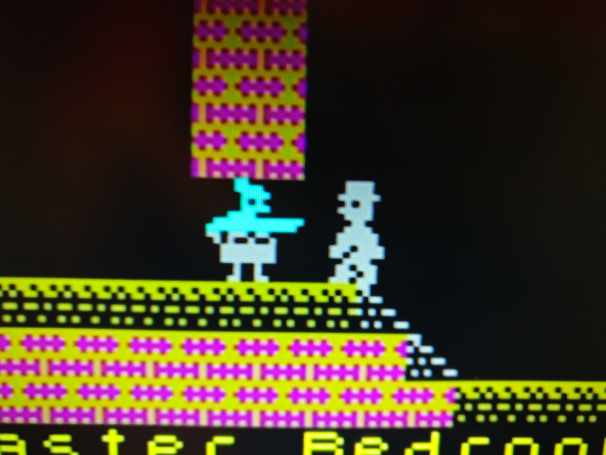

# ZXSpectrum Mod

Built on the A-Video board, this is a modification usable for the
ZX Spectrum 16K/48K versions (li'l old Speccy) that generates a
YPbPr signal in either 288p or 576p to display on modern displays.

## Motivation

As many home computers of the era, the ZX Spectrum (16K,48K) generates its
video output in the form of a composite signal that was of notoriously
bad quality, even if viewed on an analogue cathode ray tube. With 
modern LCD screens that do some digital preprocessing of the signal,
the result is even more horrible.
Even though the graphics chip (the ULA) outputs the video signal 
as a kind of RGB signal (YUV for these who know their colour formats), this
signal is still very noisy and there is a lot of digital processing
that shows up in the image. 
So this machine was also a good candidate for improvement with
my A-Video board. 

## Building

The construction uses the A-Video board with a small daughter board for shifting
the logic levels from 5V to 3.3V. 
To avoid soldering leads directly to the ULA, I took the
signals from various via points on the board - basically wherever I could
find one. In a few instances I soldered the leads to some other pins of 
various parts - but never to the ULA itself.

You may notice that the mod just fits into the tiny space that is
left in the ZX Spectrum after removing the RF modulator. That is no coincidence. 
The design of the A-Video board itself was totally driven by this exact space
constraint. 

As a side note I want to mention that I have replaced the original 
voltage regulator with its huge heat sink with a modern buck converter 
that generates nearly no heat at all. This will probably reduce the stress on the 
power supply (the original one) as well reduce the temperature in the cramped 
computer case.

## Implementation details

The FPGA chip passively listens to all relevant pins of the ULA and tries to make
sense of what is going on. 
This was not so easy as it may seem, because I was not able to directly extract the pixel
clock. There are no pins on the ULA that would directly provide this. The connection to the 
oscillator quartz is very sensitive to any added load and I could not reliably connect anything
to it without rendering the system unstable. I could also not use the clock output to the CPU 
because the ULA turns this on and off in a totally unpredictable pattern to disable CPU
access to the bus.

I figured out that it is possible to listen to the CAS line which is driven by the ULA to fetch
image data from the memory. All ULA accesses have a very distinct timing pattern and can be well
separated from the accesses that are done on behalf of the CPU. For every 8 pixels that are drawn
on the screen, the ULA fetches two bytes from the same memory row without re-sending the row
address. The FPGA always monitors these bytes and can re-construct the contents of the 
video RAM. 

With a kind of custom PLL-circuit done in the FPGA, I can generate a video output signal that
is in sync with the incoming stream of video data.

## Output

The mod can be used to create three different output formats:
* 288p
* 576p (default)
* 576p with scanlines

Selecting the output can be done by jumper connectors or an external switch:
* Connect GPIO1_15 to GPIO1_17 (or GND): 288p
* Connect GPIO1_18 to GPIO1_17 (or GND): 576p with scanlines

## Images

